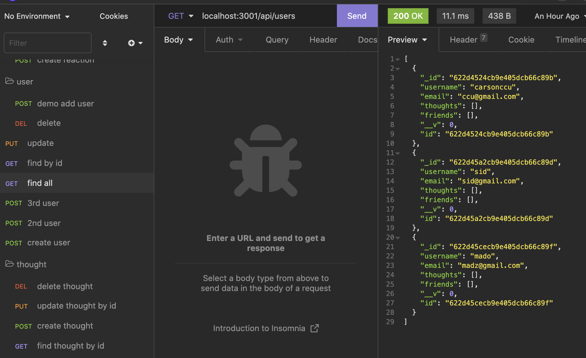

# Social-Network-API

## Description 
The purpose of this project was to use MongoDb, Mongoose, and Express in order to make a social network database where you can add delete friends, add delete a thought, and also add reactions. 

## User Story
```
AS A social media startup
I WANT an API for my social network that uses a NoSQL database
SO THAT my website can handle large amounts of unstructured data

```

## Installation
* Clone the repository using:
```
git clone https://github.com/laurelthorburn/Social-Network-API.git
```
* Ensure you are in the current working directory
* Install dependencies by opening the terminal (ctrl + j on windows) and running:
```
npm install || npm i
```
* Run the project by typing the following in the terminal:
```
npm run start || npm run dev 
```
## Screenshot


## Video

https://www.awesomescreenshot.com/video/7859139

## Links

Github: https://github.com/carsonccu/Social-Network-API

